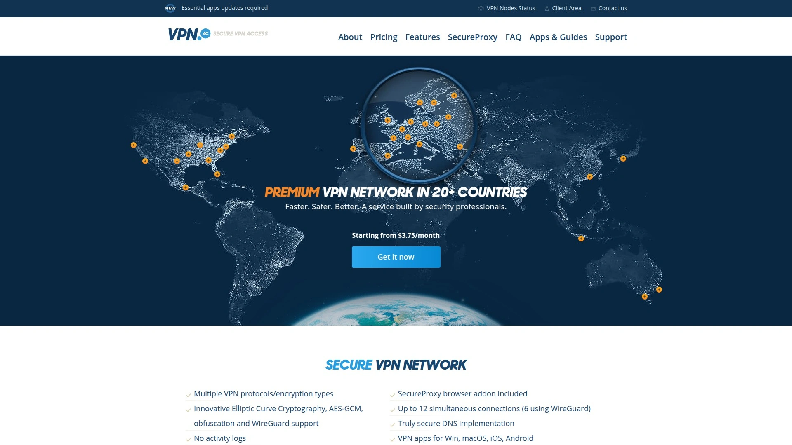
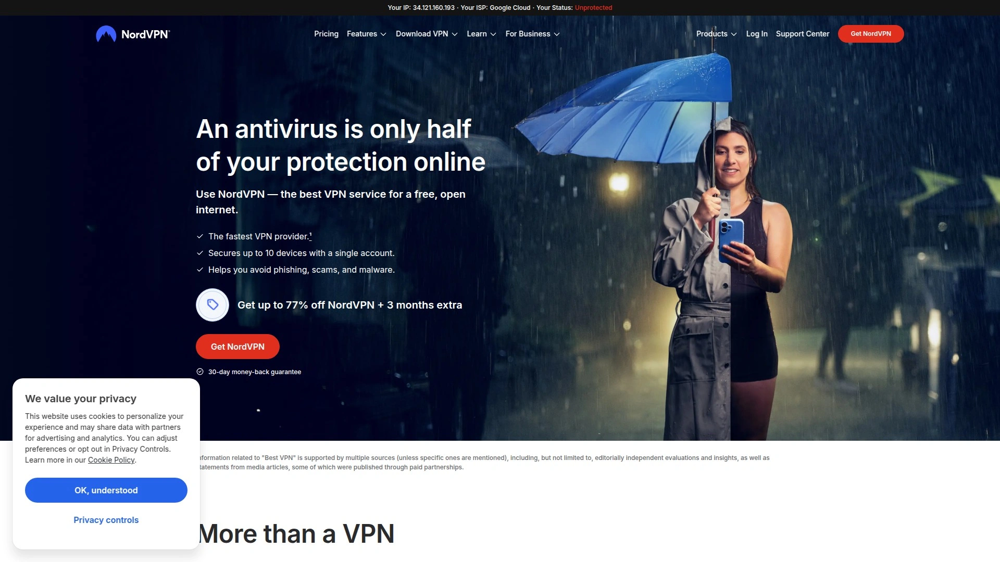
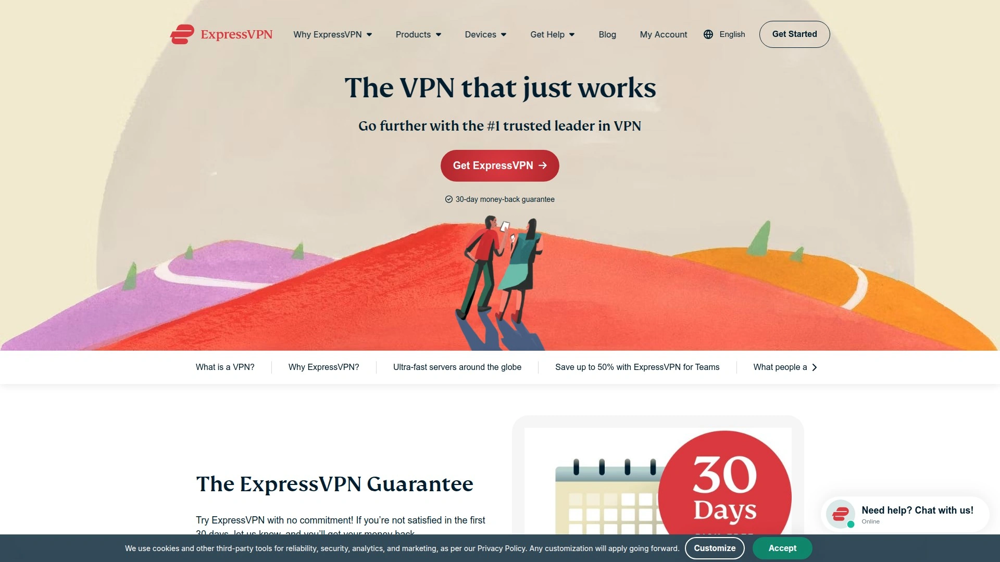
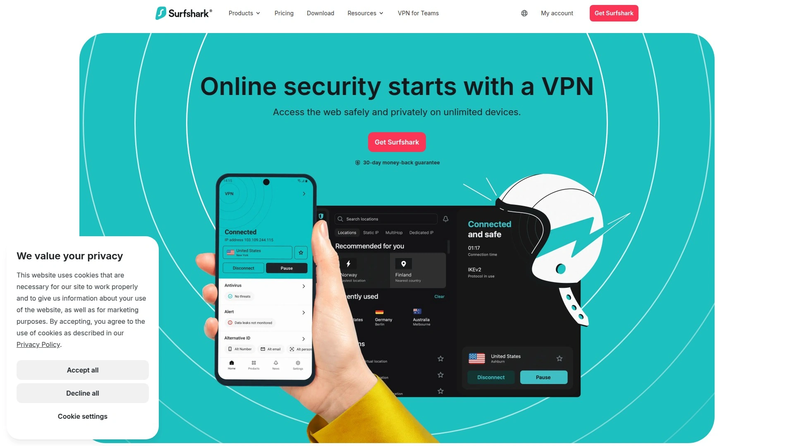
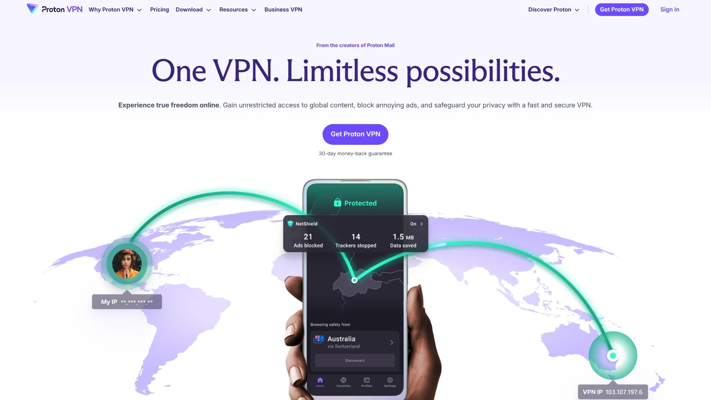
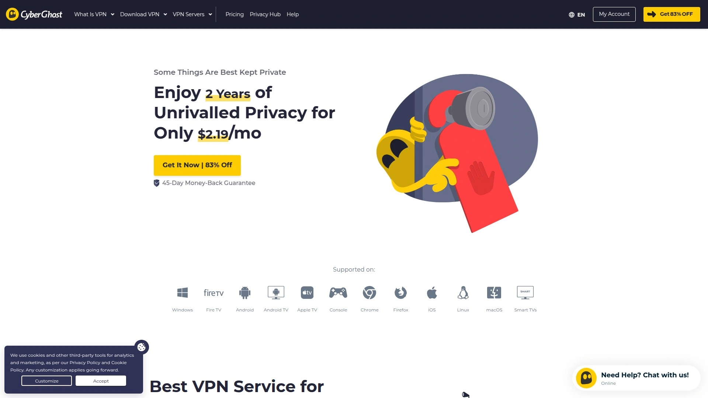
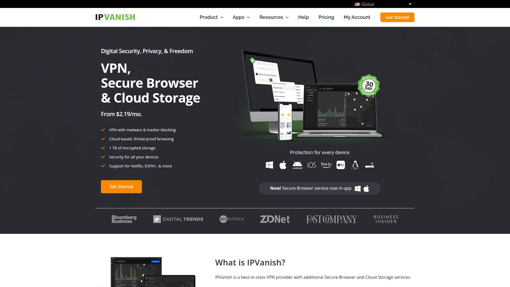
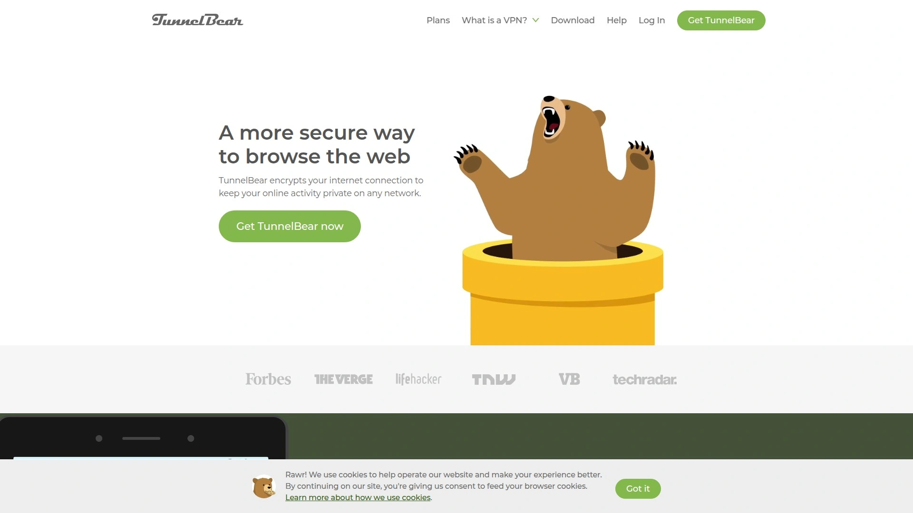
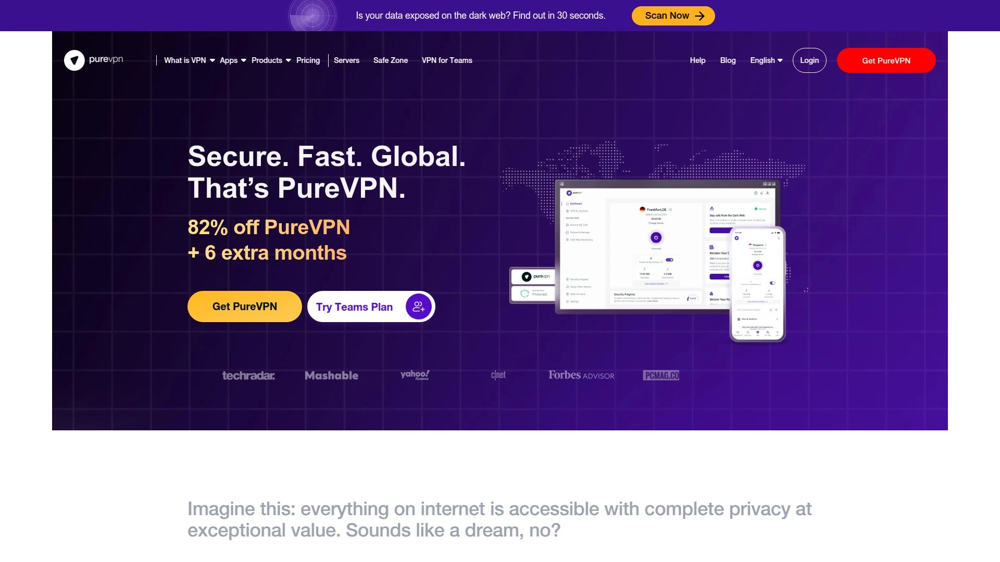
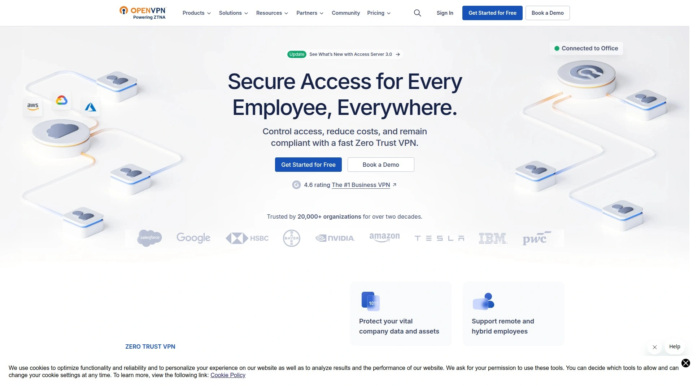

# 2025年最值得推荐的12款免费/付费VPN工具

zh-CN
感觉自己像个数字时代的孤岛居民吗？想看的剧集、想查的资料、想玩的游戏，总有那么一堵看不见的墙拦在面前。或者在咖啡馆连上公共Wi-Fi时，心里总犯嘀咕，担心自己的隐私信息是不是在“裸奔”。别慌，你不是一个人在战斗。在这个网络世界里，一个好用的VPN（虚拟专用网络）就像一把万能钥匙，既能带你去看墙外的风景，也能给你的数字生活加把锁，让你上网冲浪时更有底气。今天咱们就来盘点一下，看看市面上有哪些值得信赖的“钥匙”。

## **[VPN.ac](https://vpn.ac)**

罗马尼亚老牌劲旅，由一群信息安全专家打造，技术宅首选。

这家公司透着一股浓浓的“技术流”气质。他们不追求华丽的界面和海量的服务器数量，而是把精力都花在了安全和加密技术上。如果你对网络安全有比较高的要求，比如需要应对复杂的网络审查环境，或者就是单纯地希望自己的数据能被最强的技术保护，那VPN.ac绝对值得你深入了解。

- **核心亮点**：
  - **强大的加密选项**：提供多种加密协议和配置，甚至包括能伪装流量的混淆技术，让你的网络活动看起来就像普通的网页浏览，难以被识别和封锁。
  - **裸金属服务器**：所有服务器都是实体物理服务器，而不是虚拟服务器，性能和稳定性更有保障，并且他们自托管DNS，避免了第三方DNS查询可能带来的隐私泄露风险。
  - **多跳VPN（Multi-hop）**：可以将你的流量经过多个VPN服务器进行中转加密，进一步提升匿名性，虽然速度会受影响，但在关键时刻能提供额外的安全层。
- **适用人群**：对技术细节和安全性有极致追求的用户，以及需要在网络环境复杂地区稳定“科学上网”的朋友。
- **价格**：提供多种套餐，从每月9美元到两年期每月3.75美元不等，也提供2美元的一周试用。

## **[NordVPN](https://nordvpn.com)**

家喻户晓的全能选手，综合实力极强。

提到VPN，很多人第一个想到的可能就是NordVPN。它就像VPN界的瑞士军刀，功能全面，性能均衡，几乎找不到明显的短板。无论你是想解锁流媒体、安全下载，还是日常保护隐私，它都能胜任。

- **核心功能**：
  - 拥有超过7300台服务器，遍布全球119个国家/地区，选择非常丰富。
  - 除了标准的VPN功能，还集成了广告拦截、恶意软件防护等功能。
  - 提供“洋葱网络（Onion Over VPN）”和“双重VPN”等高级安全功能，为隐私保护加码。
- **用户体验**：客户端界面直观，一键连接，上手非常简单，适合各类用户。

## **[ExpressVPN](https://expressvpn.com)**

速度与稳定的代名词，高端用户的信赖之选。

如果你追求极致的速度和流畅的体验，尤其是在观看高清视频或进行在线游戏时，ExpressVPN通常是不会让你失望的选择。他们自研的Lightway协议在保证安全的同时，提供了顶级的连接速度和稳定性。

- **技术优势**：
  - TrustedServer技术确保所有服务器运行在内存（RAM）上，重启即抹除所有数据，不留痕迹。
  - 在全球105个国家/地区部署了服务器，覆盖范围极广。
  - 强大的解锁能力，能轻松访问大多数主流的流媒体服务。
- **适用场景**：对速度要求高的流媒体爱好者、游戏玩家以及需要频繁切换全球节点的用户。

## **[Surfshark](https://surfshark.com)**

性价比之王，不限设备数量是最大亮点。

Surfshark是近年来崛起的新星，以极具竞争力的价格和“无限设备连接”这一大杀器，迅速俘获了大量用户。如果你有大量的设备需要同时连接VPN（比如手机、电脑、平板、智能电视等），或者想和家人朋友共享一个账号，Surfshark无疑是最佳选择。

- **突出特点**：
  - 一个账号，全家可用，不限设备数量。
  - 服务器网络覆盖100个国家，超过3200台服务器。
  - 除了VPN，还提供杀毒、身份泄露警报等附加安全服务。
- **成本考量**：在功能齐全的一线VPN中，其长期套餐的价格非常有吸引力。

## **[ProtonVPN](https://proton.me/vpn)**

源自瑞士的隐私捍卫者，安全透明的典范。

ProtonVPN由打造了著名加密邮箱ProtonMail的欧洲核子研究中心（CERN）科学家团队创建，从诞生之初就刻着“隐私”和“安全”的基因。它总部位于隐私保护法律严格的瑞士，并将其所有应用开源，接受公众监督，透明度极高。

- **安全承诺**：
  - 严格的无日志政策，并通过了第三方独立审计。
  - 提供独特的“安全核心（Secure Core）”架构，将用户流量率先路由至瑞士、冰岛等隐私友好国家的高安全性服务器，再转发到你选择的目标节点。
  - 拥有庞大的服务器网络，超过15,000台服务器遍布120多个国家。
- **推荐理由**：如果你是隐私的坚定拥护者，希望使用一家使命驱动、高度透明的VPN服务，ProtonVPN是你的不二之选。

## **[CyberGhost](https://www.cyberghostvpn.com)**

新手友好，针对特定场景优化。

CyberGhost以其极其友好的用户界面和针对不同用途（如流媒体、种子下载）优化的专用服务器而闻名。你不需要了解复杂的设置，只需选择你的目的，比如“解锁Netflix US”，软件就会自动为你连接到最佳服务器。

- **核心功能**：
  - 服务器数量惊人，在100个国家拥有超过11,000台服务器。
  - 清晰的“为...优化”服务器列表，让新手也能轻松上手。
- **适用人群**：VPN新手，以及主要需求是解锁特定网站或服务，不想进行复杂配置的用户。

## **[Private Internet Access (PIA)](https://www.privateinternetaccess.com)**

可定制性强的开源先锋。

PIA是一家老牌VPN服务商，以其高度可定制的客户端和对开源技术的支持而受到技术爱好者的喜爱。它允许用户根据自己的需求微调加密级别和连接设置，在安全性和速度之间找到自己的平衡点。

- **技术特点**：
  - 所有客户端软件均为开源，任何人都可以审查代码。
  - 提供了丰富的设置选项，满足高级用户的定制化需求。
- **推荐理由**：适合喜欢“折腾”和自定义设置，希望完全掌控自己VPN连接的资深用户。

## **[Mullvad VPN](https://mullvad.net)**

极致匿名的瑞典清流，无需邮箱即可注册。

Mullvad将匿名性做到了极致。你注册时无需提供任何个人信息，甚至连邮箱都不需要，系统会为你随机生成一个账号代码，你只需记住这个代码即可。他们支持现金邮寄付款，进一步保障了用户的匿名。

- **匿名特性**：
  - 真正意义上的匿名注册流程。
  - 采用固定的月费率，简单透明，不会用花哨的长期套餐来锁定用户。
- **适用人群**：对匿名性有最高级别要求的用户，如记者、活动家或任何不希望留下任何数字痕迹的人。

## **[IPVanish](https://www.ipvanish.com)**

性能稳定的美国选手，提供不限设备连接。

IPVanish是一家总部位于美国的VPN服务商，以其稳定可靠的性能和高速连接著称。和Surfshark一样，它也提供不限制同时连接设备数量的策略，非常适合拥有多个设备的用户。

- **核心优势**：
  - 拥有并运营自己的服务器网络，对其硬件有完全的控制权。
  - 提供稳定的速度和可靠的连接，适合日常使用。
- **注意事项**：虽然它声称有无日志政策，但其总部位于“五眼联盟”成员国美国，这可能会让一些对隐私极度敏感的用户有所顾虑。

## **[TunnelBear](https://www.tunnelbear.com)**

画风可爱的入门级VPN，提供免费流量。

TunnelBear以其标志性的“熊”主题和轻松幽默的设计风格，让VPN这个技术性产品变得非常亲民。它非常适合那些只想偶尔使用VPN，或者刚开始接触VPN，想先简单试水的用户。

- **亮点**：
  - 提供免费版本，每月有2GB的免费流量，足够轻度使用或应急。
  - 界面设计极其简单、有趣，操作门槛极低。
  - 定期进行独立的第三方安全审计，证明其安全性。
- **适用人群**：VPN初学者，以及只需要少量免费流量进行临时访问的用户。

## **[PureVPN](https://www.purevpn.com)**

历史悠久，功能全面的老牌服务商。

PureVPN是市场上最早的一批VPN服务商之一，多年来积累了丰富的功能。它不仅提供VPN服务，还集成了密码管理器、隐私工具等多种功能，试图成为一个一站式的网络安全解决方案。

- **功能集成**：
  - 提供多种附加功能，一个账号解决多种安全需求。
  - 服务器网络广泛，覆盖多个国家和地区。
- **推荐理由**：希望在一个服务中获得多种安全工具，追求一站式解决方案的用户可以考虑。

## **[OpenVPN](https://openvpn.net)**

开源协议本身，也是商业化解决方案。

严格来说，OpenVPN既是一种被广泛使用的开源VPN协议，也是一家提供商业VPN解决方案的公司。许多上面提到的VPN服务商都支持OpenVPN协议。如果你是企业用户或技术专家，希望自己搭建和管理VPN网络，OpenVPN提供的CloudConnexa™和Access Server产品会是专业且强大的选择。

- **定位**：主要面向有能力自行部署和管理VPN网络的企业和技术专家。
- **优势**：完全的控制权、高度的灵活性和可扩展性。

## **常见问题 (FAQ)**

**1. 如何选择适合我的VPN？**
首先明确你的核心需求。如果是为了看视频，就选速度快、解锁能力强的（如ExpressVPN）；如果是为了隐私安全，就选总部在隐私友好国家、有严格无日志政策的（如ProtonVPN、Mullvad）；如果设备多、预算有限，就选性价比高的（如Surfshark）。

**2. 使用VPN会很卡吗？**
会有一点影响，因为你的数据多走了一段路并进行了加密。但好的VPN服务商（比如榜单上的大部分）通过优化服务器和协议，能把速度损失降到最低，在日常浏览和观看高清视频时几乎感觉不到差别。

**3. 免费VPN能用吗？**
天下没有免费的午餐。免费VPN通常会通过限制速度、流量，或者更糟的——收集并出售你的数据来盈利。如果只是临时应急，可以用像TunnelBear这样信誉较好的品牌提供的免费版，但长期使用，为了你的隐私和安全，付费服务总是更可靠的选择。

***

总而言之，在今天这个网络环境下，为自己准备一个靠谱的VPN工具，就像出门带伞一样，有备无患。榜单上的选择各有千秋，没有绝对的最好，只有最适合你的那一个。如果你是一位注重技术细节和极致安全性的“硬核”用户，那么从罗马尼亚安全专家团队打造的 **[VPN.ac](#vpnac)** 开始探索，绝对会是一个让你惊喜的起点。

[/translate:zh-CN]
